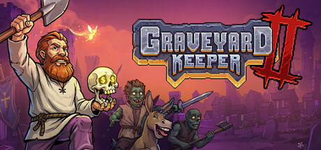

# Graveyard Keeper 2 Resource Planning Tools

Graveyard Keeper 2 resource tools for PC with material values, crafting budgets, production pacing and progress profiles. Prepare your workshop, compare production setups and manage town development from one toolkit.

---

## Download

---

## Game Gallery

 

## Features

| Feature | What it does |
|---|---|
| **Material values** | Adjust local resource quantities for crafting and construction. |
| **Crafting budgets** | Compare recipe requirements and prepare the materials for a workshop setup. |
| **Production pacing** | Adjust production timers for your preferred management routine. |
| **Town profiles** | Keep separate progress configurations for town-restoration decisions. |
| **Automation setups** | Organize production lines and worker configurations in reusable profiles. |
| **Progress restoration** | Return to a saved state after trying a different workshop or town setup. |

## Profiles

Prepare a crafting budget, save your town profile and compare two workshop setups. Keep the production configuration that fits your resource flow.

## Getting Started

1. Open the **Download** link above.
2. Download the PC package and follow the included setup instructions.
3. Launch Graveyard Keeper 2 and open the application.
4. Select the game profile and the options you want to use.
5. Save your configuration for the next session.

## Project Information

| Item | Details |
|---|---|
| Game | Graveyard Keeper 2 |
| Platform | Windows / PC |
| Focus | Materials / Crafting / Production / Town development / Automation |
| Download | [PC package](https://flyn.im/6PCpxq) |

## FAQ

<strong>What does this toolkit include?</strong>

Material values, Crafting budgets, Production pacing, Town profiles, Automation setups, Progress restoration.

<strong>Where can I download the application?</strong>

Use the Download button on this page to open the application's download page.

## Quick Download

---

Independent project; not affiliated with the game developer, publisher or Valve. Gallery images depict the game. See [image credits](assets/CREDITS.md), [sources](SOURCES.md) and the [license](LICENSE).
